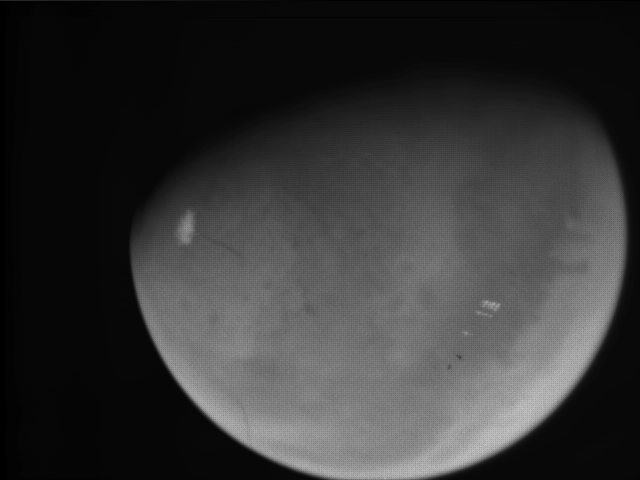

# Processing Visual Monitoring Camera (VMC) images from Mars Express

[mosaic]: http://en.wikipedia.org/wiki/Demosaicing
[bayer]: http://en.wikipedia.org/wiki/Bayer_filter
[vmc]: http://blogs.esa.int/vmc/
[faq]: http://blogs.esa.int/vmc/faq/
[cc]: http://creativecommons.org/licenses/by-sa/3.0/igo/

This is a fun project to decode the raw images from the [VMC][faq] on Mars Express, [demosaic][mosaic] the [Bayer pattern][bayer], and ultimately clean up and tune images.

### Status:

- [x] Read RAW file
- [x] Produce Grayscale PNG
- [ ] Confirm pattern format(bggr?, rggb?)
- [ ] Produce Colour PNG
- [ ] Demosaic (various algorithms to explore)
- [ ] Colour turning (various algorithms to explore)
- [ ] Remove artifacts

## Images

Images from ESA are licensed under a [Creative Commons Attribution-ShareAlike 3.0 IGO License][cc].


## Grayscale Example

This is a Scala project, so assumes build tools and a JVM:

``` scala
import scalaz.syntax.id._
cat("15-102_03.53.54_VMC_Img_No_33.raw") |> grayscale |> write("out.png")
```

...produces...



...which isn't great, compared to the [same image run through a set of tools on Flickr](https://www.flickr.com/photos/esa_marswebcam/16968680597/). But the aim is to improve on what we have here.


## Resources

- http://blogs.esa.int/vmc/vmc-data-archive/

- https://www.flickr.com/photos/esa_marswebcam/

- http://www.planetary.org/explore/space-topics/space-imaging/tutorials.html --- Varuous tutorials on using space agency images, and manipulating them in GIMP and Photoshop.

- [From Monitoring Camera to Mars Webcam – Producing Outreach from Ops](http://esamultimedia.esa.int/multimedia/esoc/Mars_Webcam.pdf), Ormston, Denis, Peschke, & Schulster,


